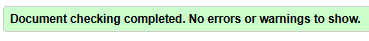
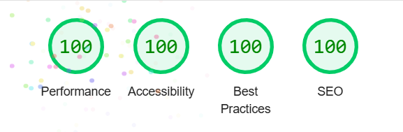
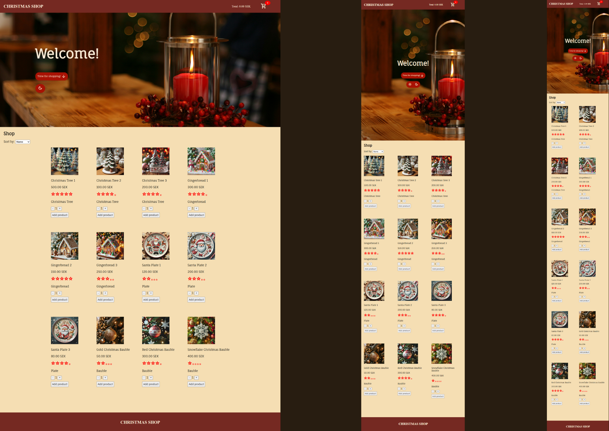

# Christmas Shop

Task with the aim of learning the basics of the JavaScript course where the goal was a webshop based on a list of requirements from a customer.

## Learning

In this project, I have gained basic knowledge in the areas of: 

- Logic & program flow
- Comments and self-documenting code
- High code quality, conventions
- Conditionals (if statements)
- Events
- DOM manipulation
- Functions
- Variables
- Arithmetic
- Object
- Arrays
- Timers
- Loops
- Date

## Technical overview

In this project, the following technologies and tools have been used:

- **HTML** – The structure of the web page.
- **SCSS** – For styling.
- **JavaScript** – For interactivity and logic.
- **Prettier** – For code formatting and styling.
- **ESLint** – To find and fix code quality issues.

## Authors

- [@ellinorjohansson](https://github.com/ellinorjohansson)

## Live version

[Christmas Shop](https://medieinstitutet.github.io/fed24d-js-intro-inl-1-webshop-ellinorjohansson/)

## Screenshots

- **HTML validation:**

- **Lighthouse:**

- **Screenshot of webshop:**

## Credit

[Unsplash](https://unsplash.com/)

[Microsoft AI images](https://designer.microsoft.com/)
